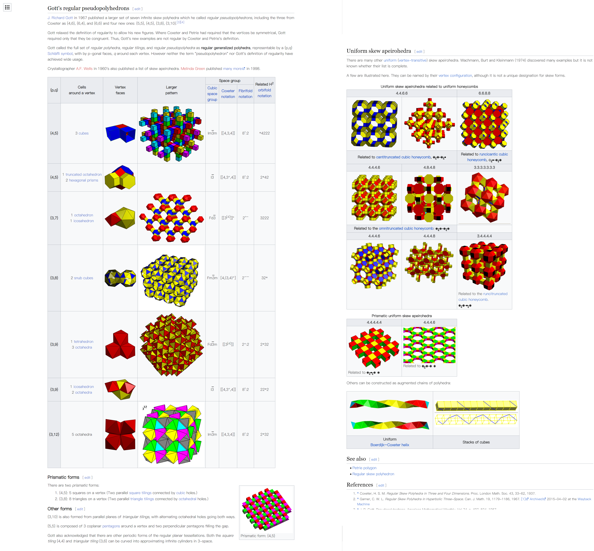

# 《Cube Infinifold》开发日志

目前还没有想好游戏名，就先空着了，之后会改文件夹位置的。
但我发现游戏名字是最关键的，不然我连给项目**新建文件夹**都没法建。
2024-3-13 更新: 终于想出名字了，可以新建文件夹了（还没）。

## 游戏名字

最开始的设想是类似于几何体的 ![Ploygon] 之类的，但是这种过于通俗直白的名字虽好，但恐怕都被占了，我也不想挤破头搞一个生僻的名字。

还想过类似 ![Manifold Valley] 之类的名字，但我认为这个名字一方面没有新意，看起来就是 ![Manifold Garden] 和 ![Monument Valley] 的超级缝合怪，但其实这个游戏从游戏性和设计上都不是那么密切的关联上面的两个游戏，而且这样还不好设计相关联的剧情，所以我干脆放弃了这个名字。

洗澡的时候又想到了可以和黑洞物理相关联，既可以迎合 **流形** 的设计理念，同时又可以绑定空间与时间上的关联性，剧情设计上也可以贴切主题，但我不希望类似 ![Fall into Blackhole] 这种过于大众化的垃圾题材 (何况这种题材适合动作类第一人称视角游戏) ，也就是没想到好名字，但不排斥。
然后还可以扯上关系的是 ![无限/无穷] ，这既是对游戏内涵的一种的提升，同时也能唤起人的遐想空间。(摊牌了，其实我就是很喜欢 ![〈Infinite Dendrogram〉-无尽连锁-] 这种名字)

大概在 ![Wikipedia] 里面扒拉了一下，我发现 **Infinity** 作为组合，基本上都被置于开头——这很直觉，能包含 Infinity 的概念，大多都是将无限的概念放在重心位置的，把无限放在词首是必然的结果。
所以我认为可以把游戏命名为形如 *XXX Infinity* 的样式，这样一方面可以强化名字的 Impression ，另一方面也不会落入 Infinity 的俗套，毕竟重心是放在 XXX 上的。

因为我不喜欢科幻，因此不会让 XXX 带有任何科学术语的色彩，因此会选择一个通俗的词作为 XXX 。 我在Wikipedia 上看到的比较好的名称包括：印度付费电视频道 ![Color Infinity] ，一家已经倒了的游戏公司 ![Digital Infinity] ，区块链游戏 ![Axie Infinity] ，一本科幻小说 ![Timelike Infinity] ，一家海洋机器人公司 ![Ocean Infinity]

然后我查流形 **Manifold** 的词源的时候，意外发现了它就只是 Many-fold 拼到一起。立刻，我就有了新思路：Infinity + fold = *Infinifold* ，直译为 *无限折叠* 。然后有一些 Skew apeirohedron 和这个概念很相似，然后它不就类似 ![Manifold Garden] 的空间结构吗。

我想到的名字包括：*Dream Infinity* ,*Cube Infinifold* , *Angle Infinity* , *Mountain Infinifold* 

目前我凭借语感暂定为 ![Cube Infinifold] ，接着是要找一个中文翻译。

> f\*\*k 我被暴杀了，突然发现![纪念碑谷]是 **纪念碑/谷** 而不是 ~~纪念/碑谷~~ ，这 TM 不就是扔翻译器里的直译吗，我可是从小到大都对 “碑谷” 怀有纯粹而美好的幻想的！

直接翻译成 `无尽流形立方体` 多少有些说不过去了，中文强调言简意赅、意在言外，这种冗长晦涩的词句不适合放在标题。

Cube 立方体，日语同样。Manifold 流形，日语为 `多様体` 。

> 多様体とは、解析学を展開するために必要な構造を備えた空間のことである。それは局所的にユークリッド空間と見なせるような図形や空間（位相空間）として定義される。

看到这个 `位相空間` ，我突然想起了一部电影《瞬息全宇宙 / Everything Everywhere All at Once》，可以看到，中文名比英文名更简短却富有韵味。

一个很不好的翻译的例子是VR游戏《Cubism / 立体主义》，这个就是翻译的时候完全没有动脑子，中文搞得莫名其妙，这个游戏本身就不是多好玩，这个不讨巧的名字至少占了劝退要素的一半。
结论是，我千万不能学习这种渣翻，真所谓人间之屑，

`立方体` 有些莫名其妙，难以传达有效信息，而 `流形` 更是不好理解，再加上一个只会更抽象的词缀 `无限` ，这三个都需要调整。
`多様体` 的意思大致为 “状态看起来很多的空间” ，倒挺合适，可惜国人理解不能。
尝试从它出发，找到一个合适的中文表达。`交错空间`作为一个词来说还可以，但是科幻意味有点浓，想办法淡化一下比较好。不过这让我想起了《阿房宫赋》的`廊腰縵迴，簷牙高啄`

中文名之后再想，我先新建文件夹。

### ![Cube Infinifold] / ![] 定为游戏名

## 参考游戏/灵感来源

### 流形园林 Manifold Garden

游戏中，玩家以第一人称，穿梭于各种空间之中，寻找特定的方块，激活机关。空间的连接性是奇特的，一扇门的背后或许是前面的路，也可能通向过去的某个门。而空间的方向性同样是不定的，通过在墙角按下空白键，玩家可以从地面走上墙壁（视角转动，将墙壁置水平，同时地面成为墙壁）。而游戏的线稿的画风，让空间的关系变得相对化，没有绝对的地面和墙面，也没有所谓的内部和外部，这种简约的风格很好的支持了游戏中空间的转换。
这种移步换景的手法会成为 ![A] 的主要手法，这也是最简单的一种应用。
但 ![Manifold Graden] 的主要局限性在于空间是完全平直的，如果能将含有曲率张量等要素融入游戏会更好。

### 纪念碑谷 
- Monument Valley
  - Monument Valley(10 levels) 49:06
  - Forgetten Shore(8 levels) 47:53
  - IDA's Dream(1 level) 20:00
- Monument Valley 2
  - Monument Valley 2(l4 levels) 65:30
  - Lost Forest (1 levels) 6:31

第一部一共游玩时间 117 分钟，第二部一共游玩时间 72 分钟。

不得不说在 ![纪念碑谷] 在视觉设计上是绝对的强者，我必须要学习、模仿、参考的。

### 超阈限空间 Superliminal

### 寻景者 Viewfinder

### little nightmire

### Portal 传送门
- Portal 传送门 1 (共 11 章)
  - 主线 (25 levels) 106:33 + (ending) 4:18
  - Bonus levels (8 levels) Infinity
  - Bonus levels 2 (???) ???
- Portal 传送门 2 (共 9 章)
  1.  礼性拜访 (8 levels) 37:13
  2.  冷启动 (8 levels) 18:17
  3.  回归 (10 levels) 30:26
  4.  惊喜 (5 levels) 25:11
  5.  逃离 (5 levels) 29:56 
  6.  坠入深渊 (6 levels) 58:45
  7.  重逢 (6 levels) 55:55
  8.  渴望 (11 levels) 55:41
  9.  葬身之地 (4 levels + ending) 46:07 + 6:31 = 52:39

Portal 2 很长，我一共游戏时间 6 小时零 4 分钟。

### 见证者 The Witness

比较迷惑，引导不足，解谜要素过浓

### 环绕走廊 Antichamber

纯纯智力小游戏

## 游戏设计

纪念碑谷你

## 程序设计

### UI 设计

![@Game] 计划使用 Rust 开发，一个首要的问题是，我们需要做到哪一步？是从底层的 OpenGL 代码写起，还是使用一些成熟的 GUI 库，抑或是直接套用到最高级的 WebAssembly GUI 框架。

我先排除了 WebAssembly GUI ，与其写成 WebAssembly GUI ，还不如我直接用 Javascript 做成网页，反正又没什么性能的追求。
然后我又排除了底层的 OpenGL ，它太麻烦了，而且各种不安全的指针操作对 Rust 很不友好。
所以一个比较好的选择就是在现有的 GUI 框架下，稍加调整，做出我们自己的界面。现有的库可以帮助我们避开底层的杂七杂八的东西，然后快速完成界面的设计和开发。
目前我找到的几个

