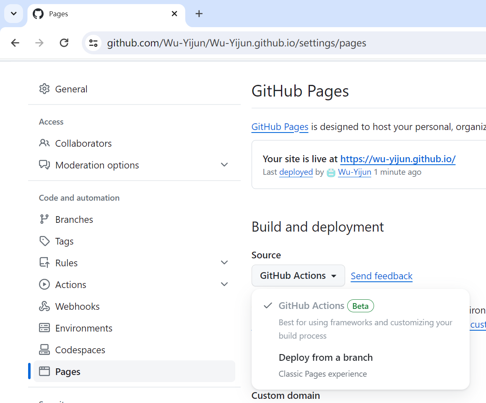

## 自定义推送行为

每次我推送都很慢，这是因为默认的处理流程很长，但是我在本地的都是静态页面，几乎没有需要进行额外处理。因此我决定自己控制gitpages的推送过程。

然后很简单，在库的setting的pages下的source切换为github action即可。

接着直接选中下方的静态页面。

时间从50秒减为30秒。

Fininshed

我考虑到性能因素，决定将外部库移出此项目，作为**Include-Outer**的页面发布资源。